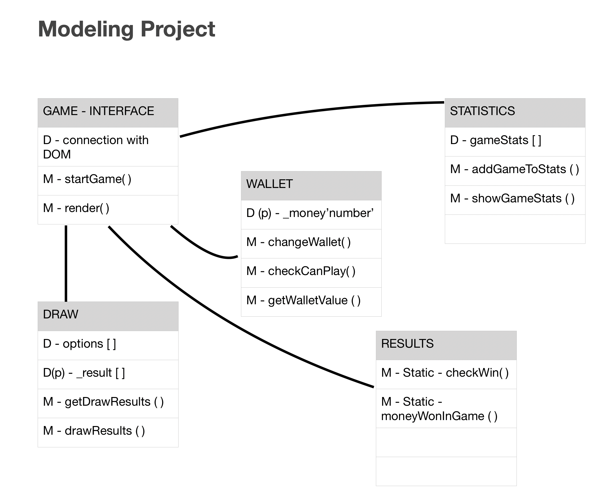

# Case Study - Game - One-armed bandit [OOP,CSS,JS] 

In this project I used Object-oriented programming with 5 diffrent Classes. Map of the app below: 

CSS: 

Not much here. Used Flex and @media for 1024px

